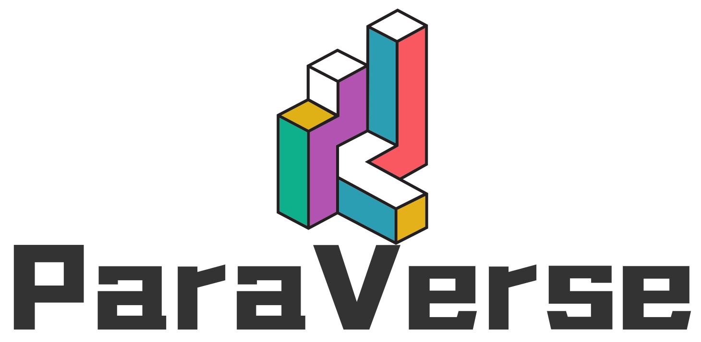

# ParaVerse Simulator

 

**ParaVerse(Parallel Universe)** is a scalable and flexible Everything to Vehicle (X2V) smart city simulator for researchers 
and developers to test their scenarios and ideas with minimum effort.

If you are looking for a quick warm-up with ParaVerse and our group, 
please check out our summarized slides [Google Slides](https://docs.google.com/presentation/d/1DxH0wLFgYcnp_ZKmALKPOR64ElqBzudmUaJTJUJg6rc/edit?usp=sharing)

More information, please find in our home page : https://paraverse.group/

Join our Slack channel to contact us: [Click to Join Slack Channel](https://join.slack.com/t/paraverse-group/shared_invite/zt-1d0dsns2r-USGamHXDKlBNA9ADha0XHg)

Join our Discord: [Click to Join our community](https://discord.gg/Y7fYRm5SBy)

Our Linkedin page： [Linkedin](https://www.linkedin.com/company/paralleluniverse)
